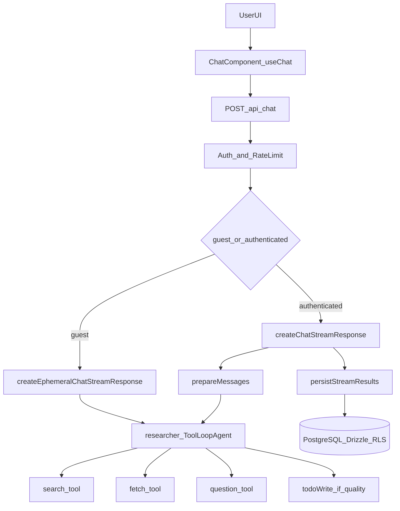
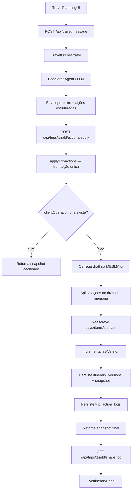
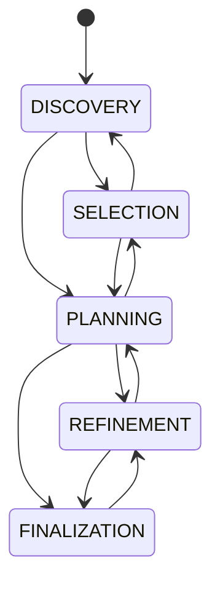

# Estudo de Arquitetura e Fluxos da Aplicação

## 1) Contexto e stack técnico

Esta aplicação é um motor de busca com interface generativa baseado em Next.js (App Router), com execução de agentes/tool-calling via Vercel AI SDK, persistência em PostgreSQL (Drizzle ORM) e integração opcional com Supabase/Auth, Redis e Langfuse.

Principais blocos tecnológicos identificados no código:

- Frontend + servidor web: Next.js 16 com App Router.
- Linguagem e qualidade de tipo: TypeScript em modo `strict`.
- IA e streaming: `ai` SDK com `useChat`, `ToolLoopAgent`, SSE e stream de UI messages.
- Banco: PostgreSQL + Drizzle + políticas de RLS (Row-Level Security).
- Busca: providers pluggáveis (Tavily, SearXNG, Brave, Exa, Firecrawl) com seleção por configuração.
- Observabilidade: OpenTelemetry + Langfuse.
- Testes: Vitest + Testing Library (jsdom para UI).

## 2) Mapa de módulos e responsabilidades

### `app/` (rotas e API)

- `app/page.tsx`: entrada principal e inicialização do chat.
- `app/search/page.tsx`: inicia chat com query (`q`) e gera ID de sessão.
- `app/search/[id]/page.tsx`: carrega chat persistido por ID e aplica validações de acesso.
- `app/api/chat/route.ts`: endpoint central do chat, auth, rate limit, seleção de modelo e dispatch de streaming (persistente ou efêmero).
- `app/api/advanced-search/route.ts`: busca avançada com SearXNG + cache Redis.
- `app/api/upload/route.ts`: upload para R2 com validação de tipo/tamanho.
- `app/api/feedback/route.ts`: grava feedback no Langfuse e metadados de mensagem.
- `app/api/chats/route.ts`: paginação de histórico de chats.

### `components/` (UI e composição)

- `components/chat.tsx`: orquestra a experiência de chat no cliente com `useChat`, envio de mensagens, regeneração, erro, drag/drop e navegação para `/search/[id]`.
- `components/chat-messages.tsx`, `components/chat-panel.tsx` e afins: renderização de mensagens e input.

### `lib/agents/` e `lib/tools/` (núcleo de raciocínio e ferramentas)

- `lib/agents/researcher.ts`: monta o agente (`ToolLoopAgent`) com tools ativas por modo (`quick`/`adaptive`) e tipo de modelo (`speed`/`quality`).
- `lib/tools/search.ts`: tool de busca com schema de entrada por modelo e execução incremental (`searching` -> `complete`).
- `lib/tools/fetch.ts`: extração de conteúdo URL (`regular` ou `api` via Jina/Tavily).
- `lib/tools/question.ts`: tool para pergunta de clarificação com schema por modelo.
- `lib/tools/todo.ts`: tool de planejamento interno habilitada condicionalmente.

### `lib/streaming/` (pipeline de resposta)

- `create-chat-stream-response.ts`: streaming autenticado com persistência.
- `create-ephemeral-chat-stream-response.ts`: streaming para guest sem persistência.
- `helpers/prepare-messages.ts`: preparação de contexto, edição/regeneração e otimização de novo chat.
- `helpers/persist-stream-results.ts`: persistência resiliente de resposta e título.

### `lib/db/` + `lib/actions/` (dados e consistência)

- `lib/db/schema.ts`: schema relacional + policies RLS para `chats`, `messages`, `parts`, `feedback`.
- `lib/db/with-rls.ts`: execução transacional com `set_config('app.current_user_id', ...)`.
- `lib/db/actions.ts`: operações de dados com RLS opcional/obrigatório e mapeamento UI <-> DB.
- `lib/actions/chat.ts`: camada de aplicação com cache/revalidate, autorização e operações de chat.

## 3) Fluxos funcionais detalhados

## 3.1 Fluxo de chat (fim a fim)



Sequência técnica:

1. `components/chat.tsx` usa `useChat` com `DefaultChatTransport` apontando para `/api/chat`.
2. O payload varia por trigger:
   - `submit-message`: envia última mensagem do usuário.
   - `regenerate-message`: envia `messageId` para regeneração contextual.
   - Guest envia histórico completo (`messages`) a cada request para manter contexto efêmero.
3. `app/api/chat/route.ts` valida payload, resolve usuário (`getCurrentUserId`), aplica regras de guest/auth, rate-limit e seleção de modelo.
4. Roteamento:
   - Guest: `createEphemeralChatStreamResponse`.
   - Usuário autenticado/anon mode com ID válido: `createChatStreamResponse`.
5. O agente de pesquisa executa loop de tools com limite de passos:
   - `quick`: busca otimizada e menor profundidade operacional.
   - `adaptive`: mais passos e, em `quality`, pode habilitar `todoWrite`.
6. Resposta é enviada via SSE (`createUIMessageStreamResponse`), incluindo metadados (`traceId`, `searchMode`, `modelId`).
7. No modo persistente, ao final, resposta é salva em banco e o título pode ser atualizado.

## 3.2 Fluxo de busca e providers

1. A tool `createSearchTool()` aplica schema de entrada adequado ao modelo.
2. Provider é resolvido por:
   - tipo da chamada (`general`/`optimized`);
   - provider dedicado para `general` (quando disponível);
   - fallback para `SEARCH_API` ou `DEFAULT_PROVIDER`.
3. Caminho especial para SearXNG advanced:
   - chamada interna para `/api/advanced-search`;
   - cache Redis por chave composta de query/parâmetros;
   - crawling e re-ranking para melhora de relevância.
4. Resultado é normalizado para `SearchResults` e enriquecido com `citationMap`.

## 3.3 Fluxo de autenticação, anônimo e guest

Há três comportamentos distintos no código:

- Auth Supabase habilitado:
  - `getCurrentUserId()` retorna ID real de usuário autenticado.
- Modo anônimo (`ENABLE_AUTH=false`):
  - retorna `ANONYMOUS_USER_ID` (ou `anonymous-user`);
  - bloqueado se `MORPHIC_CLOUD_DEPLOYMENT=true`.
- Guest sem usuário (`!userId`):
  - permitido apenas se `ENABLE_GUEST_CHAT=true`;
  - sem persistência de chat;
  - limite por IP aplicável via `checkAndEnforceGuestLimit`.

`proxy.ts` integra sessão Supabase quando configurada e mantém headers de base URL para contexto do runtime.

## 3.4 Fluxo de upload

`app/api/upload/route.ts`:

1. Exige usuário autenticado (ou ID anônimo válido conforme modo).
2. Aceita apenas `multipart/form-data`.
3. Valida:
   - tamanho máximo (5MB),
   - tipos permitidos (`jpeg`, `png`, `pdf`).
4. Sanitiza nome de arquivo e envia para R2 (`PutObjectCommand`).
5. Retorna URL pública + metadados.

## 3.5 Fluxo de feedback

`app/api/feedback/route.ts`:

1. Valida `traceId` e `score`.
2. Se tracing ativo, envia score para Langfuse.
3. Opcionalmente atualiza feedback na mensagem (metadado DB) via action.
4. Falhas de persistência não quebram a resposta principal do endpoint.

## 4) Persistência, segurança de dados e consistência

## 4.1 Modelo de dados

Entidades principais:

- `chats`: conversa (owner, visibilidade, título).
- `messages`: cabeçalho da mensagem.
- `parts`: conteúdo granular da mensagem (texto, tool calls, arquivos, fontes etc.).
- `feedback`: feedback de usuário.

## 4.2 RLS e contexto de usuário

Padrão adotado:

1. `withRLS(userId, callback)` abre transação.
2. Define `app.current_user_id` no escopo da transação.
3. Policies do Postgres em `schema.ts` aplicam filtragem por owner/public.
4. Erros de policy são convertidos para `RLSViolationError` quando detectados.

Resultado: segurança em duas camadas

- lógica de aplicação (checks explícitos de ownership/autorização),
- enforcement no banco via RLS.

## 4.3 Cache e invalidação

- `unstable_cache` em `loadChat` com tags (`chat-${chatId}`).
- Após mutações de chat/mensagens, `revalidateTag` é disparado.
- Evita leituras obsoletas e reduz round-trips.

## 4.4 Estratégia de consistência no streaming

Para chat novo:

- `prepareMessages` inicia persistência otimista de chat + primeira mensagem em paralelo.
- `persistStreamResults` aguarda essa promessa antes de salvar a resposta da IA.
- Há fallback para cenários de falha e tratamento de duplicate key.

Isso reduz latência percebida sem abrir mão de consistência final.

## 5) Padrões de qualidade identificados

## 5.1 Type safety e contratos

- `tsconfig.json` em `strict: true`.
- Tipos utilitários para tools e agente (`lib/types/agent.ts`).
- Tipagem forte para modelos/modos (`ModelType`, `SearchMode`, `Model`).

## 5.2 Validação de entrada e schemas

- Ferramentas com `zod` (ex.: `questionSchema`, `todoItemSchema`).
- Validação explícita de payload em rotas críticas (`/api/chat`, `/api/feedback`, `/api/upload`).
- Validação estrutural de configuração de modelos (`load-models-config.ts`).

## 5.3 Tratamento de erros resiliente

Padrão recorrente:

- validar cedo com respostas HTTP claras (400/401/403/404),
- logs diagnósticos no servidor,
- operações não críticas desacopladas (analytics/feedback/title update não derrubam fluxo principal),
- retry em persistência de mensagem da IA.

## 5.4 Observabilidade e performance

- logs de performance (`perfLog`, `perfTime`) em etapas críticas.
- tracing opcional Langfuse com `parentTraceId` e metadata.
- OpenTelemetry registrado em `instrumentation.ts`.

## 5.5 Organização e legibilidade

- import sorting obrigatório via `eslint-plugin-simple-import-sort`.
- estilo consistente via Prettier (`semi: false`, `singleQuote: true`, etc.).
- separação clara de camadas (rota -> streaming -> agente -> tools -> persistência).

## 5.6 Estratégia de testes

Cobertura de unidades/integrações em módulos críticos:

- `lib/db/__tests__` (RLS/políticas),
- `lib/streaming/__tests__` e helpers,
- `lib/utils/__tests__`,
- `app/api/feedback/__tests__`,
- `components/__tests__`.

`vitest.setup.ts` provê mocks de APIs Next para isolar comportamento.

## 6) Riscos, gaps e débitos técnicos observados

1. **Workflows CI/release/docker-build comentados**
   - Arquivos em `.github/workflows/` estão presentes, mas com conteúdo inteiramente comentado.
   - Risco: falsa sensação de enforcement automático em PR/release.

2. **Desalinhamento entre documentação histórica e estado atual**
   - Referências a rotas/pastas que não existem no estado atual (ex.: caminho de `share` citado em docs antigas, mas pasta não presente no `app/` atual).
   - Risco: onboarding confuso e decisões com premissas incorretas.

3. **Dependência de variáveis de ambiente para caminhos críticos**
   - Múltiplos modos de execução (auth, guest, anonymous, cloud) são corretos, mas exigem matriz de configuração bem controlada.
   - Risco: comportamento inesperado entre ambientes.

4. **Complexidade do pipeline de streaming**
   - Fluxo robusto, porém com muitas ramificações (trigger, modo, provider, persistência otimista, tracing).
   - Risco: regressões sutis sem testes de contrato end-to-end por cenário.

## 7) Guia prático para novo código aderente aos padrões do projeto

Diretrizes objetivas para qualquer código novo nesta base:

1. **Respeite a arquitetura em camadas**
   - UI em `components/`,
   - orquestração HTTP em `app/api`,
   - lógica de domínio em `lib/actions` e `lib/streaming`,
   - acesso a dados em `lib/db`.

2. **Faça validação explícita na borda**
   - valide payloads de rota imediatamente;
   - use schemas `zod` para contracts de tools e entradas complexas.

3. **Mantenha segurança em dupla camada**
   - checks de ownership na aplicação;
   - operações de dados via `withRLS`/`withOptionalRLS`.

4. **Desenhe para streaming resiliente**
   - operações não críticas não devem quebrar resposta principal;
   - preserve semântica de fallback/retry onde já existe.

5. **Siga padrões de tipo e estilo**
   - TypeScript estrito, imports ordenados, formato Prettier;
   - prefira tipos já existentes em `lib/types`.

6. **Observe e meça**
   - inclua logs de tempo (`perfTime`) em novos trechos críticos;
   - preserve metadata de tracing quando mexer em streaming/agentes.

7. **Garanta cobertura de testes nos caminhos críticos**
   - adicione testes de unidade/integração próximos ao módulo alterado;
   - cubra variações de modo (`quick/adaptive`, `guest/authenticated`, `speed/quality`).

## 8) Resultado consolidado do estudo

O código atual mostra uma arquitetura madura para aplicações de chat com IA:

- fronteira HTTP enxuta e validada,
- pipeline de streaming robusto,
- seleção dinâmica de modelo/tools por modo,
- persistência consistente com RLS,
- observabilidade integrada.

Os principais pontos de atenção não estão no desenho interno do runtime, mas na governança operacional externa (workflows comentados) e no alinhamento entre documentação histórica e implementação corrente.

Em termos de padrão de qualidade, o projeto já estabelece uma base sólida e reutilizável para futuras features, desde que novos desenvolvimentos mantenham:

- os contratos tipados/schemas,
- os guardrails de segurança (RLS + ownership),
- e a filosofia de resiliência do streaming (não bloquear resposta por efeitos secundários).

## 9) Evolução alvo: AI Travel Concierge

Esta seção especifica a evolução da plataforma para planejamento de viagens com **roteiro vivo** e **ações estruturadas transacionais**.

### 9.1 Arquitetura completa do sistema



Decisões arquiteturais:

- **Dois canais de resposta da IA**: mensagem natural (texto) + plano de ações estruturadas (JSON tipado).
- **Transação única**: toda mutação de roteiro ocorre dentro de uma única chamada `withRLS` — sem transações aninhadas.
- **Snapshot versionado**: cada operação lógica gera um snapshot completo em `itinerary_versions`.
- **Idempotência por `clientOperationId`**: replay da mesma operação retorna resultado cacheado sem mutação.
- **Materialização completa**: dias/itens/fontes são reescritos a cada versão (simplifica lógica de merge e garante consistência).

Módulos implementados:

| Camada               | Arquivo                                         | Responsabilidade                                                                                               |
| -------------------- | ----------------------------------------------- | -------------------------------------------------------------------------------------------------------------- |
| Tipos de domínio     | `lib/travel/types.ts`                           | `TripState`, `TripAction`, `TripDraft`, `TravelAssistantEnvelope`                                              |
| Validação Zod        | `lib/travel/schemas.ts`                         | Schemas discriminados por ação, envelope, request/response                                                     |
| State machine        | `lib/travel/state-machine.ts`                   | Transições válidas, guidance por estado, normalização                                                          |
| Orquestrador         | `lib/travel/orchestrator.ts`                    | Heurística inicial de geração de ações (placeholder para LLM)                                                  |
| Serviço transacional | `lib/actions/trip-actions.ts`                   | `applyTripActions`, `getTripSnapshot`, `createTrip`, `listTripActionLogs`                                      |
| Schema DB            | `lib/db/schema.ts`                              | Tabelas `trips`, `itinerary_days`, `itinerary_items`, `trip_sources`, `itinerary_versions`, `trip_action_logs` |
| Relations            | `lib/db/relations.ts`                           | Drizzle relations para queries relacionais                                                                     |
| Migration            | `drizzle/0011_ai_travel_concierge.sql`          | DDL completo com RLS, índices e constraints                                                                    |
| API message          | `app/api/travel/message/route.ts`               | Recebe mensagem → gera envelope → retorna proposta                                                             |
| API apply            | `app/api/trips/[tripId]/actions/apply/route.ts` | Aplica lote de ações transacionalmente                                                                         |
| API snapshot         | `app/api/trips/[tripId]/snapshot/route.ts`      | Retorna estado consolidado do roteiro                                                                          |

### 9.2 Modelo de dados detalhado

#### Entidades

**`trips`** — viagem do usuário

| Coluna                     | Tipo                         | Nota                         |
| -------------------------- | ---------------------------- | ---------------------------- |
| `id`                       | `varchar(191)` PK            | CUID2                        |
| `user_id`                  | `varchar(255)` NOT NULL      | owner, base para RLS         |
| `title`                    | `varchar(256)` NOT NULL      | título da viagem             |
| `origin`                   | `varchar(256)`               | cidade de origem             |
| `destination`              | `varchar(256)`               | destino principal            |
| `start_date`               | `varchar(256)`               | data início (ISO string)     |
| `end_date`                 | `varchar(256)`               | data fim                     |
| `budget_min_cents`         | `integer`                    | orçamento mínimo em centavos |
| `budget_max_cents`         | `integer`                    | orçamento máximo em centavos |
| `currency`                 | `varchar(3)`                 | código ISO 4217              |
| `trip_state`               | `varchar(256)` NOT NULL      | estado da state machine      |
| `preferences`              | `jsonb` NOT NULL             | preferências estruturadas    |
| `last_version`             | `integer` NOT NULL DEFAULT 0 | contador monotônico          |
| `created_at`, `updated_at` | `timestamp`                  | timestamps                   |

CHECK: `budget_max_cents >= budget_min_cents` (quando ambos presentes).

**`itinerary_days`** — dia do roteiro

| Coluna      | Tipo                    | Nota                     |
| ----------- | ----------------------- | ------------------------ |
| `id`        | `varchar(191)` PK       | CUID2                    |
| `trip_id`   | FK → `trips.id` CASCADE | viagem pai               |
| `day_index` | `integer` NOT NULL      | posição do dia (>0)      |
| `date`      | `varchar(256)`          | data específica opcional |

UNIQUE: `(trip_id, day_index)`. CHECK: `day_index > 0`.

**`itinerary_items`** — ponto de parada

| Coluna         | Tipo                             | Nota                                                                  |
| -------------- | -------------------------------- | --------------------------------------------------------------------- |
| `id`           | `varchar(191)` PK                | CUID2                                                                 |
| `trip_id`      | FK → `trips.id` CASCADE          | viagem pai                                                            |
| `day_id`       | FK → `itinerary_days.id` CASCADE | dia pai                                                               |
| `item_type`    | `varchar(256)` NOT NULL          | `attraction \| restaurant \| hotel \| transport \| activity \| other` |
| `title`        | `varchar(256)` NOT NULL          | nome do local                                                         |
| `description`  | `text`                           | descrição                                                             |
| `location`     | `text`                           | endereço/coordenadas                                                  |
| `duration_min` | `integer`                        | duração estimada em minutos                                           |
| `position`     | `integer` NOT NULL               | ordem dentro do dia (>0)                                              |
| `source_id`    | FK → `trip_sources.id` SET NULL  | fonte de origem                                                       |
| `metadata`     | `jsonb` NOT NULL DEFAULT `{}`    | dados adicionais                                                      |

UNIQUE: `(day_id, position)`. CHECKs: `position > 0`, `duration_min > 0` (quando presente).

**`trip_sources`** — fontes consultadas

| Coluna                          | Tipo                    | Nota               |
| ------------------------------- | ----------------------- | ------------------ |
| `id`                            | `varchar(191)` PK       | CUID2              |
| `trip_id`                       | FK → `trips.id` CASCADE | viagem pai         |
| `url`                           | `text` NOT NULL         | URL da fonte       |
| `title`, `publisher`, `snippet` | `text`/`varchar`        | metadados da fonte |

**`itinerary_versions`** — snapshot versionado

| Coluna                | Tipo                    | Nota                        |
| --------------------- | ----------------------- | --------------------------- |
| `id`                  | `varchar(191)` PK       | CUID2                       |
| `trip_id`             | FK → `trips.id` CASCADE | viagem                      |
| `version_number`      | `integer` NOT NULL      | monotônico por viagem       |
| `base_version`        | `integer` NOT NULL      | versão de origem            |
| `client_operation_id` | `varchar(191)` NOT NULL | chave de idempotência       |
| `summary`             | `text`                  | mensagem do assistente      |
| `snapshot`            | `jsonb` NOT NULL        | estado completo serializado |
| `created_by`          | `varchar(255)` NOT NULL | userId                      |

UNIQUEs: `(trip_id, version_number)`, `(trip_id, client_operation_id)`.

**`trip_action_logs`** — auditoria granular

| Coluna                | Tipo                                      | Nota                           |
| --------------------- | ----------------------------------------- | ------------------------------ |
| `id`                  | `varchar(191)` PK                         | CUID2                          |
| `trip_id`             | FK → `trips.id` CASCADE                   | viagem                         |
| `version_id`          | FK → `itinerary_versions.id` SET NULL     | versão associada               |
| `client_operation_id` | `varchar(191)` NOT NULL                   | agrupador                      |
| `action_type`         | `varchar(256)` NOT NULL                   | tipo da ação                   |
| `payload`             | `jsonb` NOT NULL                          | payload completo               |
| `status`              | `varchar(256)` NOT NULL DEFAULT `applied` | `pending \| applied \| failed` |
| `error_text`          | `text`                                    | mensagem de erro (se falhou)   |
| `created_by`          | `varchar(255)` NOT NULL                   | userId                         |

#### Relações

```
trips 1:N itinerary_days 1:N itinerary_items
trips 1:N trip_sources
trips 1:N itinerary_versions 1:N trip_action_logs
itinerary_items N:1 trip_sources (opcional)
```

#### RLS

Todas as tabelas travel têm policies `FOR ALL TO public` usando:

```sql
EXISTS (SELECT 1 FROM trips WHERE trips.id = trip_id
  AND trips.user_id = current_setting('app.current_user_id', true))
```

Mesmo padrão existente no domínio chat.

### 9.3 State machine de viagem



Cada estado define o comportamento esperado do concierge:

| Estado         | Objetivo do concierge                                            | Guidance prompt               |
| -------------- | ---------------------------------------------------------------- | ----------------------------- |
| `DISCOVERY`    | Coletar preferências, orçamento, datas, origem, companhia, ritmo | Perguntas abertas, exploração |
| `SELECTION`    | Comparar destinos, trade-offs                                    | Comparações objetivas         |
| `PLANNING`     | Construir itinerário dia a dia                                   | Criar dias + itens ordenados  |
| `REFINEMENT`   | Otimizar roteiro, equilibrar ritmo/custo                         | Ajustes finos, reordenação    |
| `FINALIZATION` | Checklist final: reservas, documentos, logística                 | Confirmações e pendências     |

Transições são validadas em `lib/travel/state-machine.ts` e no serviço transacional. Transição para o mesmo estado é sempre permitida (idempotente).

### 9.4 Catálogo de ações estruturadas

| Ação                      | Payload                                 | Efeito                                        |
| ------------------------- | --------------------------------------- | --------------------------------------------- |
| `CREATE_DAY`              | `{ dayIndex, date? }`                   | Cria dia (idempotente se já existe)           |
| `REMOVE_DAY`              | `{ dayIndex }`                          | Remove dia e seus itens                       |
| `ADD_ITEM`                | `{ item: ItineraryItemInput }`          | Adiciona item ao dia (cria dia se necessário) |
| `REMOVE_ITEM`             | `{ itemId }`                            | Remove item, normaliza posições               |
| `MOVE_ITEM`               | `{ itemId, toDayIndex, toPosition? }`   | Move item entre dias                          |
| `REORDER_ITEMS`           | `{ dayIndex, orderedItemIds[] }`        | Reordena itens (IDs devem coincidir)          |
| `UPDATE_ITEM`             | `{ itemId, patch }`                     | Atualiza campos do item                       |
| `UPDATE_TRIP_PREFERENCES` | `{ patch: TripPreferences }`            | Merge de preferências                         |
| `UPDATE_DATES`            | `{ startDate?, endDate?, dayDates? }`   | Atualiza datas globais e por dia              |
| `UPDATE_BUDGET`           | `{ budgetMin?, budgetMax?, currency? }` | Atualiza orçamento (valida max≥min)           |
| `SET_TRIP_STATE`          | `{ tripState }`                         | Transição de estado (validada)                |

Envelope de saída da IA (`TravelAssistantEnvelope`):

```json
{
  "assistant_message": "Sugeri um roteiro inicial de 3 dias em Roma.",
  "trip_state_next": "PLANNING",
  "client_operation_id": "op_abc123",
  "actions": [
    { "type": "CREATE_DAY", "payload": { "dayIndex": 1 } },
    {
      "type": "ADD_ITEM",
      "payload": {
        "item": {
          "type": "attraction",
          "title": "Coliseu",
          "dayIndex": 1,
          "durationMin": 120
        }
      }
    }
  ]
}
```

### 9.5 Especificação de API

#### `POST /api/travel/message`

Recebe mensagem do usuário, gera proposta estruturada (texto + ações).

Request:

```json
{
  "tripId": "optional — cria nova trip se ausente",
  "message": "Quero um roteiro de 4 dias em Roma",
  "clientOperationId": "optional"
}
```

Response `200`:

```json
{
  "tripId": "generated-or-existing-trip-id",
  "assistant": {
    "assistant_message": "...",
    "trip_state_next": "PLANNING",
    "client_operation_id": "op_x",
    "actions": [...]
  }
}
```

Erros: `400` (payload inválido), `401` (não autenticado), `500`.

#### `POST /api/trips/:tripId/actions/apply`

Aplica lote de ações com transação única, idempotência e versionamento.

Request:

```json
{
  "tripId": "trip_id",
  "clientOperationId": "op_x (min 8 chars)",
  "assistantMessage": "opcional",
  "tripStateNext": "REFINEMENT",
  "actions": [{ "type": "CREATE_DAY", "payload": { "dayIndex": 1 } }]
}
```

Response `200`:

```json
{
  "version": 3,
  "idempotent": false,
  "snapshot": {
    "tripId": "trip_id",
    "version": 3,
    "tripState": "REFINEMENT",
    "preferences": { ... },
    "days": [
      {
        "dayIndex": 1,
        "date": "2026-05-01",
        "items": [
          {
            "id": "item_cuid",
            "type": "attraction",
            "title": "Coliseu",
            "description": "...",
            "location": "...",
            "durationMin": 120,
            "position": 1,
            "source": { "url": "...", "title": "..." }
          }
        ]
      }
    ]
  }
}
```

Se `idempotent: true`, a operação já havia sido aplicada — retorna resultado anterior sem mutação.

Erros: `400` (payload inválido, tripId mismatch), `401`, `500`.

#### `GET /api/trips/:tripId/snapshot`

Retorna estado consolidado do roteiro para painel vivo.

Response `200`:

```json
{
  "tripId": "trip_id",
  "version": 3,
  "tripState": "PLANNING",
  "preferences": { ... },
  "days": [ ... ]
}
```

Erros: `401`, `500`.

### 9.6 Fluxo transacional de atualização

Passos do `applyTripActions` (tudo dentro de uma única `withRLS`):

1. **Autenticação** — `getCurrentUserId()` antes da chamada.
2. **Abrir transação RLS** — `withRLS(userId, async tx => { ... })`.
3. **Check de idempotência** — busca `itinerary_versions` por `(tripId, clientOperationId)`. Se encontrada, retorna snapshot cacheado.
4. **Carregar draft** — `loadDraftFromTx(tx, tripId)` carrega trip + dias + itens + fontes **na mesma transação** (sem nesting).
5. **Aplicar ações em memória** — `applyActionsToDraft(draft, actions, tripStateNext)` com validações de invariantes.
6. **Reescrever materialização** — deleta e reinsere `days`, `items`, `sources`.
7. **Atualizar `trips`** — bump `lastVersion`, sincroniza campos denormalizados.
8. **Persistir `itinerary_versions`** — snapshot JSON completo.
9. **Persistir `trip_action_logs`** — uma entrada por ação do lote.
10. **Retornar** — `{ version, idempotent: false, snapshot }`.

Invariantes aplicadas em `applyActionsToDraft`:

- posições contínuas por dia (`1..N`) via normalização pós-mutação;
- `REORDER_ITEMS` exige conjunto de IDs idêntico ao estado atual;
- `SET_TRIP_STATE` e `tripStateNext` validam arestas da state machine;
- `UPDATE_BUDGET` valida `budgetMax >= budgetMin` (Zod refinement).

### 9.7 Estratégia de versionamento e idempotência

**Versionamento:**

- `lastVersion` no `trips` é monotônico (incrementado atomicamente na transação).
- Cada versão armazena `baseVersion` (estado de origem) e snapshot JSON completo.
- Permite reconstrução instantânea do estado de qualquer versão sem replay.

**Idempotência:**

- Chave natural: `(tripId, clientOperationId)` com unique index.
- Se o par já existe em `itinerary_versions`, retorna `{ idempotent: true, snapshot }` sem mutação.
- Garante segurança em retries de rede e reprocessamento.

**Auditoria:**

- Cada ação individual é registrada em `trip_action_logs` com:
  - `versionId` (agrupador),
  - `actionType`, `payload` completo,
  - `status` (`applied` | `failed`),
  - `createdBy` (userId).

### 9.8 Estrutura de prompts para o concierge

Estratégia de prompting em camadas:

1. **Prompt base** — contexto de concierge de viagens, regras de saída obrigatória (texto + JSON de ações).
2. **Guidance por estado** — instrução complementar baseada no `tripState` atual:
   - `DISCOVERY` → coletar preferências, explorar possibilidades,
   - `SELECTION` → comparar destinos com trade-offs objetivos,
   - `PLANNING` → construir itinerário estruturado dia a dia,
   - `REFINEMENT` → otimizar ritmo, custo, deslocamentos,
   - `FINALIZATION` → fechar checklist, confirmar reservas.
3. **Contexto do draft atual** — snapshot serializado para que o LLM saiba o estado corrente do roteiro.
4. **Catálogo de ações disponíveis** — schema das ações para que o LLM gere apenas ações válidas.

Implementação atual: `lib/travel/orchestrator.ts` usa heurística simples como placeholder. Na Fase 2, será substituído por chamada real ao LLM com prompt estruturado.

### 9.9 Regras de validação (três camadas)

**Camada de API (Zod — `lib/travel/schemas.ts`):**

- `travelMessageRequestSchema` — mensagem de entrada.
- `applyTripActionsRequestSchema` — lote de ações.
- `tripActionSchema` — discriminated union de 11 tipos de ação.
- `travelAssistantEnvelopeSchema` — contrato de saída da IA.
- Refinements: `budgetMax >= budgetMin`, `patch` não vazio em `UPDATE_ITEM`.

**Camada de domínio (`lib/actions/trip-actions.ts`):**

- Transições de estado válidas (via `isValidTripStateTransition`).
- `REORDER_ITEMS` com conjunto exato de IDs.
- Normalização de posições contínuas pós-mutação.
- Imutabilidade do draft original (deep clone antes de mutar).

**Camada de banco (DDL + Drizzle):**

- `CHECK (day_index > 0)`, `CHECK (position > 0)`, `CHECK (duration_min > 0)`.
- `CHECK (budget_max_cents >= budget_min_cents)` (quando ambos presentes).
- `UNIQUE (trip_id, day_index)`, `UNIQUE (day_id, position)`.
- `UNIQUE (trip_id, version_number)`, `UNIQUE (trip_id, client_operation_id)`.
- RLS em todas as tabelas travel.

### 9.10 Cobertura de testes

Testes implementados:

| Arquivo                                      | Escopo                                                                                    |
| -------------------------------------------- | ----------------------------------------------------------------------------------------- |
| `lib/travel/__tests__/schemas.test.ts`       | Validação Zod de todas as ações, envelopes, edge cases                                    |
| `lib/travel/__tests__/state-machine.test.ts` | Transições válidas/inválidas, normalização, guidance                                      |
| `lib/actions/__tests__/trip-actions.test.ts` | `applyActionsToDraft`: CREATE/REMOVE/ADD/MOVE/REORDER/UPDATE, multi-action, imutabilidade |

### 9.11 Estratégia de evolução incremental (roadmap técnico)

**Fase 1 — Fundação (implementada neste skeleton):**

- Modelo de dados travel + migration + RLS + unique indexes.
- Contratos Zod discriminados para 11 tipos de ação.
- Serviço transacional com idempotência, versionamento e auditoria.
- Endpoints base (`/api/travel/message`, `/api/trips/:id/actions/apply`, `/api/trips/:id/snapshot`).
- State machine com transições e guidance por estado.
- Testes unitários para schemas, state machine e `applyActionsToDraft`.

**Fase 2 — Integração com LLM real:**

- Substituir heurística do orchestrator por chamada real ao LLM (system prompt + catálogo de ações + draft atual).
- Feature flag para rotear chat genérico vs. travel concierge.
- Painel lateral de roteiro vivo consumindo `GET /snapshot`.
- Streaming da resposta textual do concierge em paralelo com aplicação de ações.

**Fase 3 — Inteligência avançada:**

- Otimização geográfica/temporal (janelas de horário, deslocamento, agrupamento por proximidade).
- Merge de ações conflitantes (ex.: mover item para dia que está sendo removido).
- Exportação estruturada (PDF, ICS, compartilhamento público de roteiro).

**Fase 4 — Observabilidade e qualidade:**

- Métricas específicas de planejamento (tempo em cada estado, itens por viagem, taxa de refinamento).
- Testes e2e dos principais cenários (happy path de 3-day trip, ajustes iterativos, backtrack de estado).
- Rate limiting e quotas por tier de usuário para operações travel.
